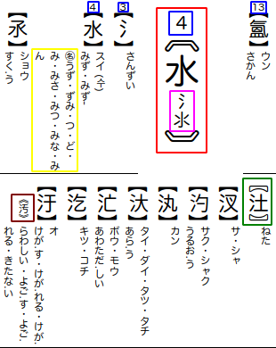

# Kanji Sakuin

A complete Japanese kanji index dictionary.

This dictionary is meant as a reference to find kanji when you dont have access to an electronic dictionary. (the same reason why you might want a physical regular dictionary)

It's sorted by radical and stroke count.

# Download

If unsure what to download, [download this](./kanji-sakuin-byside.pdf).

There are 2 versions of the dictionary.

 1. **“Inside”**: With kanji variants inside of the black lenticular brackets
     1. works best with firefox
 1. **“Byside”**: With kanji variants next to the black lenticular brackets
     1. for chrome users that don't like the look of version 1
     1. the pic below is from this version

- **Links**:
  - **Byside**: [html](), [pdf]()
  - **Inside**: [html](), [pdf]()

## Key

 - **Red**: Radical headings are big and surrounded by tortoise shell brackets: 〘radical〙
 - **Purple**: variants of a given radical.
 - **Blue**: stroke count (including the radical)
 - **Kanji**: regular kanji are surrounded by black lenticular brackets: 【kanji】
 - **Green**: Kokuji (国字) kanji are surrounded by white lenticular brackets: 〖kokuji〗
 - **Brown**: variants (異体字/俗字) of a given kanji are surrounded by double angle brackets: 《variant》
 - **Readings**:
   - **Katakana**: onyomi
   - **Hirigana**: kunyomi
   - **Yellow/following "㊔"**: nanori (名乗り)
